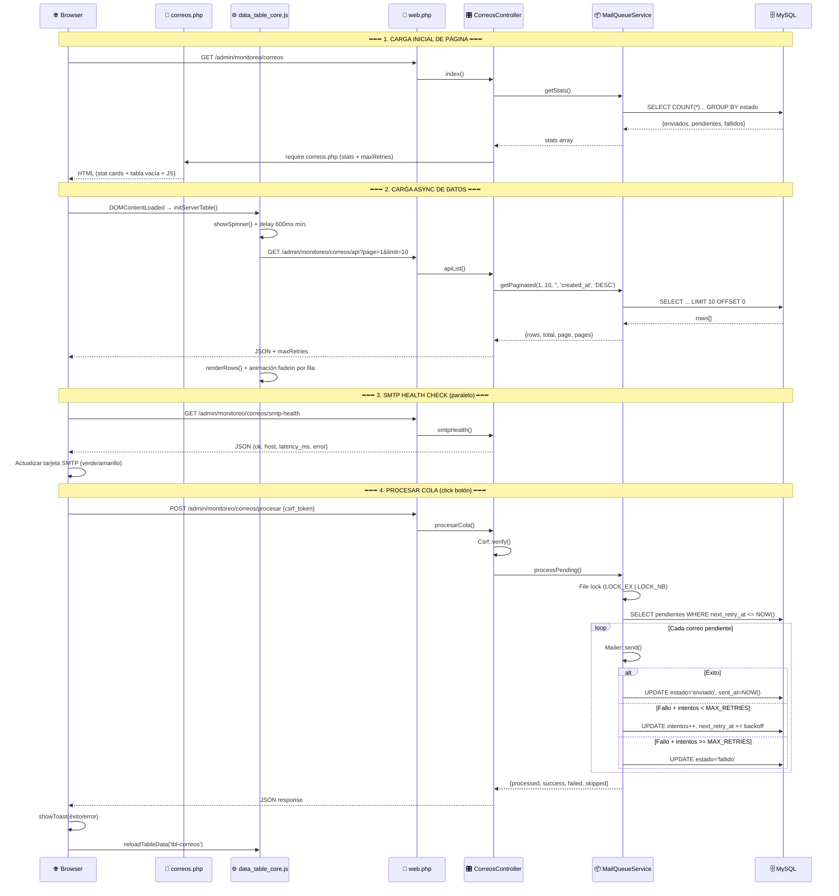

# Flujo Completo: Tabla de Correos

## Diagrama General



---

## Componentes Involucrados

| Componente | Archivo | Rol |
|---|---|---|
| **Rutas** | [web.php](file:///c:/xampp/htdocs/tesis_francisco/routes/web.php#L213-L233) | 4 rutas: index, procesar, api, smtp-health |
| **Controlador** | [CorreosController.php](file:///c:/xampp/htdocs/tesis_francisco/src/Modules/Admin/Controllers/Monitoreo/CorreosController.php) | 4 métodos: [index](file:///c:/xampp/htdocs/tesis_francisco/src/Modules/Admin/Controllers/Monitoreo/CorreosController.php#17-28), [apiList](file:///c:/xampp/htdocs/tesis_francisco/src/Modules/Admin/Controllers/Monitoreo/CorreosController.php#46-70), [smtpHealth](file:///c:/xampp/htdocs/tesis_francisco/src/Modules/Admin/Controllers/Monitoreo/CorreosController.php#29-45), [procesarCola](file:///c:/xampp/htdocs/tesis_francisco/src/Modules/Admin/Controllers/Monitoreo/CorreosController.php#71-104) |
| **Servicio** | [MailQueueService.php](file:///c:/xampp/htdocs/tesis_francisco/src/Core/MailQueueService.php) | [getStats()](file:///c:/xampp/htdocs/tesis_francisco/src/Core/MailQueueService.php#278-307), [getPaginated()](file:///c:/xampp/htdocs/tesis_francisco/src/Core/MailQueueService.php#331-390), [processPending()](file:///c:/xampp/htdocs/tesis_francisco/src/Core/MailQueueService.php#176-277) |
| **Vista** | [correos.php](file:///c:/xampp/htdocs/tesis_francisco/resources/views/admin/monitoreo/correos.php) | Stat cards + DataTable server-side + botón Procesar |
| **DataTable Engine** | [data_table_core.js](file:///c:/xampp/htdocs/tesis_francisco/public/assets/js/global/data_table_core.js#L164-L389) | Modo server-side: fetch, spinner, paginación, sort |
| **Toasts** | [utils.js](file:///c:/xampp/htdocs/tesis_francisco/public/assets/js/global/utils.js#L38-L72) | [showToast(msg, type)](file:///c:/xampp/htdocs/tesis_francisco/public/assets/js/global/utils.js#32-73) — reemplazo global de `alert()` |

---

## Flujo Detallado por Fase

### 1. Carga Inicial (GET `/admin/monitoreo/correos`)

**`CorreosController::index()`** carga las stat cards con datos de BD y renderiza la vista. La tabla se envía **vacía** (`<tbody></tbody>`) — los datos se cargan vía AJAX.

### 2. Carga de Datos (auto, AJAX)

Al dispararse `DOMContentLoaded`, [data_table_core.js](file:///c:/xampp/htdocs/tesis_francisco/public/assets/js/global/data_table_core.js) detecta `data-server-url` en la tabla e inicia **modo server-side**:

1. Muestra **spinner** con texto "Cargando..."
2. Hace [fetch(GET /admin/monitoreo/correos/api?page=1&limit=10)](file:///c:/xampp/htdocs/tesis_francisco/public/assets/js/global/data_table_core.js#317-345)
3. Espera mínimo **600ms** (consistente con profesores/estudiantes)
4. Llama a `renderCorreoRow()` (custom renderer definido en la vista) por cada fila
5. Aplica **animación fadeIn** escalonada (30ms entre filas)

### 3. SMTP Health Check (paralelo)

Una IIFE `async` en la vista hace [fetch(GET .../smtp-health)](file:///c:/xampp/htdocs/tesis_francisco/public/assets/js/global/data_table_core.js#317-345) inmediatamente. Actualiza la tarjeta SMTP:

| Resultado | Color tarjeta | Texto |
|---|---|---|
| `ok: true` | 🟢 Verde | "Conectado" + host + latency |
| `ok: false` | 🟡 Amarillo | "Sin conexión" + error |
| Excepción JS | — | "Error de red" |

### 4. Búsqueda, Ordenamiento y Paginación

Todas operan server-side via la misma ruta `GET /api`:

| Acción | Parámetros enviados | Debounce |
|---|---|---|
| Buscar | `search=texto` | 350ms |
| Ordenar | `sort=columna&order=ASC/DESC` | inmediato |
| Cambiar página | `page=N` | inmediato |
| Cambiar filas/página | `limit=10/25/50`, `page=1` | inmediato |

Cada acción muestra spinner → fetch → 600ms mín. → renderRows con animación.

### 5. Botón "Procesar Cola" (POST)

```
Click → btn.disabled=true → "Procesando..."
  └→ POST /admin/monitoreo/correos/procesar {csrf_token}
     └→ CorreosController::procesarCola()
        └→ Csrf::verify() ← falla? → JSON {success:false, "Token CSRF inválido."}
        └→ MailQueueService::processPending()
           └→ File lock ← ocupado? → JSON {success:false, "Ya hay un proceso activo."}
           └→ SELECT pendientes WHERE next_retry_at <= NOW() LIMIT 20
              └→ Por cada correo: Mailer::send()
                 ├→ OK  → UPDATE estado='enviado'
                 ├→ Fail + intentos < 4 → UPDATE intentos++, next_retry_at += 2^n×2 min
                 └→ Fail + intentos ≥ 4 → UPDATE estado='fallido'
        └→ JSON {success:true, message: "Procesados: X, Exitosos: Y, Fallidos: Z"}
```

---

## Mensajes al Usuario (Toasts)

| Situación | Tipo | Mensaje |
|---|---|---|
| Cola procesada exitosamente | 🟢 `success` | `"Procesados: X, Exitosos: Y, Fallidos: Z"` |
| CSRF inválido | 🔴 `error` | `"Token CSRF inválido."` |
| Lock activo (otro proceso corriendo) | 🔴 `error` | `"Ya hay un proceso activo."` |
| Excepción interna en controlador | 🔴 `error` | `"Error al procesar la cola."` |
| Fallo de red (fetch catch) | 🔴 `error` | `"Error de conexión."` |
| Sesión expirada (res.redirected) | — | `location.reload()` → redirige a login |
| Tabla recargada (data_table_core) | 🟢 `success` | `"Actualizado"` (solo en modo client-side) |
| Error cargando datos de tabla | ❌ red text | `"Error al cargar datos"` (inline en tbody) |

### Respuestas JSON del Servidor en Errores Silenciosos

Estos se manejan con `try/catch` en el backend y **nunca llegan al usuario** (solo `error_log`):

| Método | Fallo interno | Respuesta JSON fallback |
|---|---|---|
| [apiList()](file:///c:/xampp/htdocs/tesis_francisco/src/Modules/Admin/Controllers/Monitoreo/CorreosController.php#46-70) | Excepción en [getPaginated()](file:///c:/xampp/htdocs/tesis_francisco/src/Core/MailQueueService.php#331-390) | `{rows:[], total:0, page:1, pages:1, maxRetries:4}` |
| [smtpHealth()](file:///c:/xampp/htdocs/tesis_francisco/src/Modules/Admin/Controllers/Monitoreo/CorreosController.php#29-45) | Excepción en `Mailer::checkHealth()` | `{ok:false, host:'', latency_ms:null, error: msg}` |
| [procesarCola()](file:///c:/xampp/htdocs/tesis_francisco/src/Modules/Admin/Controllers/Monitoreo/CorreosController.php#71-104) | Excepción general | `{success:false, message:'Error interno.'}` |

---

## Custom Row Renderer

La función `renderCorreoRow(row, index, data)` en la vista genera el HTML de cada fila:

| Columna | Contenido | Detalle |
|---|---|---|
| # | Índice global | Calculado: [(page-1)*limit + i](file:///c:/xampp/htdocs/tesis_francisco/public/assets/js/global/utils.js#6-7) |
| Tipo | Badge morado | `bienvenida`, `rif_sucesoral`, `reset_password` |
| Destinatario | Email en texto | — |
| Asunto | Texto truncado 50 chars | Tooltip con texto completo |
| Estado | Badge con color | `pendiente`→naranja, `enviado`→verde, `fallido`→rojo |
| Intentos | `N / 4` | N actual vs MAX_RETRIES |
| Fecha | `created_at` | — |
| Próximo Reintento | `next_retry_at` o "—" | Solo para pendientes |
